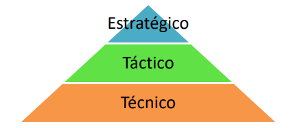
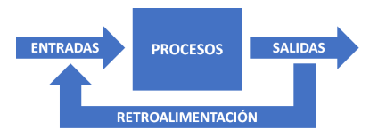
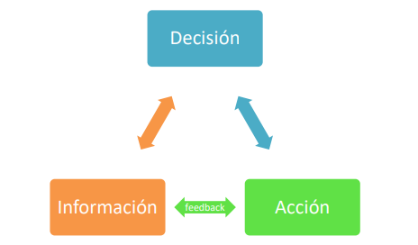
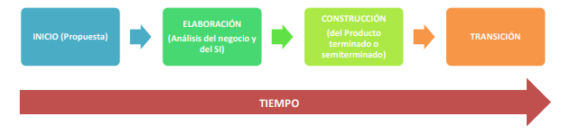

# Teoría

## Unidad 1

### Información

La información no es un dato aislado, esta tiende a ser muy extensa.

La información es un conjunto de datos de diferentes tipos, adecuadamente procesados que proveen un mensaje que tiene sentido comunicacional para contribuir a la toma de decisiones e incrementar el conocimiento.

#### Funciones de la Información

- Aumentar el conocimiento
- Reducir la incertidumbre
- Ayudar a la toma de decisiones
- Permitir realizar controles de tareas y eventos

#### Clasificación de la información

> Imagen tomada de la Figura 1 del apunte provisto por la materia_

- **Técnica**: Información que es relevante para la toma de decisiones operativas del díd a día de una organización. El resultado es evidente en el corto plazo.
- **Táctica**: Información que es utilizada para la toma de decisiones relacionadas con la coordinación y comunicación entre distintas area de la organización. Se asocia a la toma de decisiones para el corto y mediano plazo.
- **Estratégica**: Esta información es vital para tomar decisiones que garanticen la supervivencia de la organización y tienen un impacto al corto, mediano y largo plazo.

### Gestión de Procesos

En todas las organizaciones existen procesos que funcionan de acuerdo a las políticas de la organización y el objetivo de negocio. Gestionar cada uno de estos procesos es lo que se conoce como "Gestión de Procesos"

Para lograr una eficiente gestión de procesos es fundamental que sean identificados y que cumplan con las siguientes características:

1. Ser horizontales
2. Que pueda ser definido
3. Limites que permitan acotar su comienzo y final
4. Que puedan ser representados gráficamente
5. Que sean medibles y controlables
6. Que tengan un responsable a cargo

#### Clasificación de los procesos

- **Procesos Clave**: Son los responsables de desarrollar el producto o servicio que entrega la organización, los procesos operativos propios de la actividad de la organización (_Ej.: Proceso de producción, procesos de ventas, etc._)
- **Procesos Estratégicos**: Dedicados al diseño y la planificación de las estrategias y objetivos de la organización (_Ej.: Proceso de planificación de presupuesto, Proceso de diseño de producto, etc._)
- **Procesos de Apoyo**: Son los que entregan apoyo a los procesos clave de la organización, tiene como objetivo proporcionar los recursos que necesita la organización (_Ej.:Proceso de Formación, Proceso de Logística, etc._)

### Sistema de Información

Un sistema de información es un conjunto de elementos orientados al tratamiento y administración de datos e información, generados y organizados para cubrir una necesidad u objetivo.

Las actividades básicas de un sistema de información son:

- **Entrada**: Son los datos obtenidos a partir de la operatoria de la organización
- **Procesos**: Son las operaciones que se le realizan a los datos con el fin de producir información.
- **Salida**: Es el producto resultante de procesar los datos y que es distribuido a los interesados en forma de informes, estadísticas, etc.
- _Retroalimentación_: Mucha de la información producida (salidas), sirve de entrada para el sistema como retroalimentación para su análisis.

> Imagen tomada de la Figura 2 del apunte provisto por la materia

#### Clasificación de los sistemas según su función

- **TPS** _<small>'60</small>_ : Los "**Sistemas de Procesamiento de Transacciones**" tenían la función de procesar transacciones de la organización, por ejemplo pagos, cobros, etc.
- **MIS** _<small>'60-'70</small>_ : Los "**Sistemas de Información Gerencial**"  tienen como objetivo principal mostrar una visión general de la situación de la empresa para la toma de decisiones por parte de los directivos de la organización.
- **DSS** _<small>'70-'80</small>_ : Los "**Sistemas de soporte a decisiones**" son una herramienta de análisis de variables de negocio para apoyar la toma de decisiones.
- **EIS** _<small>'80</small>_ : Los "**Sistemas de Información Ejecutiva**" permiten monitorear el estado de las variables de un área de la organización a partir de información interna y externa a la misma.
- **OAS** _<small>'80</small>_ : Los "**Sistemas de Automatización de Oficinas**" ayudan en el trabajo diaria administrativo de la organización.
- **SE** _<small>'90</small>_ : Los "**Sistemas Expertos**" están diseñados para resolver problemas complejos usando el razonamiento. Estos fueron las primeras formas de **Inteligencia Artificial**.
- **ERP** _<small>'90</small>_ : Los "**Sistemas de Planificación de Recursos**" integran la información de los procesos de la organización en un solo sistema.

### Toma de Decisión

Desde hace mucho tiempo las organizaciones han reconocido que la información es uno de los recursos mas importante con los que cuenta una organización ya que es un apoyo fundamental para la toma de decisiones y la reducción de la incertidumbre.

La información es muy importante en el proceso de toma de decisiones ya que puede reducir el numero de alternativas o clasificar los beneficios o riesgos facilitando la tarea al tomador de decision. Por ser un recurso muy importante, debemos sacar el máximo provecho de este, administrando de manera efectiva la información, teniendo en cuenta su producción, distribución, seguridad,  almacenamiento y recuperación; es por esto que debemos contar con un sistema de información confiables, oportuno y actualizado.

> _Imagen tomada de la Figura 5 del apunte provisto por la materia_

El proceso de toma de decisión comienza con detectar una situación que rodea a un problema, analizar esta situación y definir el problema.
Tomar una decisión supone escoger una alternativa, para lo cual necesitamos información sobre estas y las consecuencias ya que selección que hagamos supondrá que se genere nueva información que podrá servir de base para una nueva decisión a tomar y asi sucesivamente.

#### Clasificación de la decisiones en función de la posición jerárquica del decisor

1. **Decisiones Estratégicas**: Son decisiones tomadas en la cumbre de la pirámide jerárquica, tomadas por los altos directivos. Suelen estar orientadas a definir los objetivos estratégicos de la organización.
2. **Decisiones Tácticas**: Estas son tomadas por directivos intermedios y buscar gestionar los recursos de la mejor manera para alcanzar los objetivos estratégicos.
3. **Decisiones Operativas**: Son decididas por los mandos mas bajos de la organización y están referidas a las actividades rutinarias de la empresa.

### Análisis y Metodología de Sistemas

Se trata de estudiar un sistema mediante el enfoque sistémico, atendiendo al planteo del problema a resolver, en donde intervienen personas, recursos físicos, materiales y tiempo.

#### Metodología de Sistemas

La metodología de sistemas es un método que provee herramientas y procedimientos, que son confiables y repetibles, y se adecúan particularmente bien al problema que pretenden resolver o al producto que se quiere desarrollar.

- **Métodos**: Indican como construir técnicamente el sistema, desde la planificación, estimación, análisis de requerimientos, diseño, arquitectura, codificación, pruebas, puesta en producción y mantenimiento.
- **Herramientas**: Suministran un soporte automático o semiautomático para los métodos. Un ejemplo son las herramientas de gestión como Jira, Trello; o las herramientas de modelado como StartUML, PlantUML.
- **Procedimientos**: Relaciona métodos y herramientas para definir la secuencia en la que se aplican los métodos, las entregas que se requieren, los controles que deben hacerse para el aseguramiento de la calidad y la coordinación en los cambios y las directrices que deben seguir los gestores del proyecto para evaluar el progreso.

Existen dos grandes grupos donde encuadrar a las metodologías, el entorno **tradicional** y el entorno **ágil**, sin embargo comparten un conjunto de características comunes que definen el ciclo de vida típico de un sistema.

> _Imagen tomada de la Figura 8 del apunte provisto por la materia_

- **Inicio**: Es la _"visión del sistema"_, donde se establece el alcance del proyecto y se toma la decisión de comenzar con el mismo (se decide realizar la inversión de dinero y esfuerzo).
- **Elaboración**: Se hace el análisis del sistema de negocio para el cual se busca solución, se define la estructura general del sistema de información, se identifican los factores de riesgo del proyecto y se elabora el plan detallado.
- **Construcción**: Es la fabricación del sistema de información con todos sus productos de apoyo (documentación, casos de prueba, etc.). En esta etapa se revisan las definiciones de las fases anteriores. 
- **Transición**: El sistema se entrega a los usuarios; esta fase incluye la instalación, configuración, soporte a usuarios y correcciones si fuera necesario. Finaliza cuando los usuarios están satisfechos con el sistema.

### Metodología Tradicional

Estas metodologías buscan una fuerte planificación y documentación durante todo el desarrollo del proyecto, es decir, se sustentan en llevar una documentación exhaustiva y cumplir con un plan de proyecto estricto y cerrado, centrando su atención en la planificación por adelantado y la gestión de procesos.

Estas características las hace indicadas para proyectos donde se presentan objetivos claramente definidos desde el inicio y proyectos a largo plazo que no tengan restricciones de tiempos.

Existen 4 actividades fundamentales para la ingeniería de software:

1. **Especificación de requerimientos**: Es donde se definen las funcionalidades que el software debe tener y las restricciones de su operación.
2. **Diseño e implementación del software**: Se representa un modelo que cubra las especificaciones definidas en la actividad anterior.
3. **Validación del software**: En esta actividad se valida que el software está de acuerdo con la especificación definida y cumpla con lo que usuario quiere.
4. **Evolución del software**: Es la evolución del software ara cubrir nuevas necesidades o cambios que el usuario quiere.

#### Modelo clásico en Cascada

