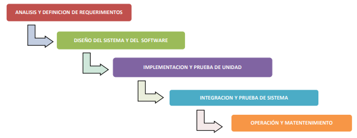
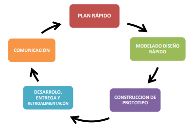
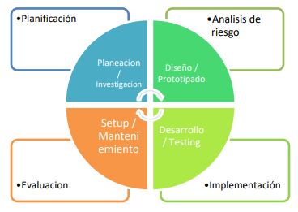
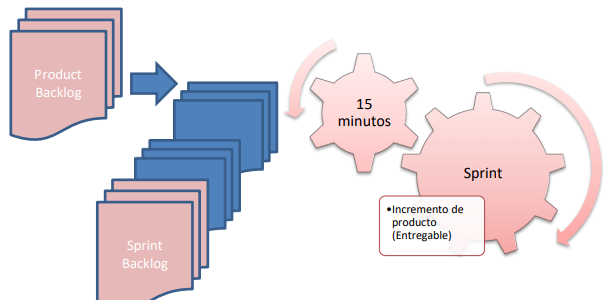
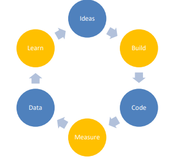
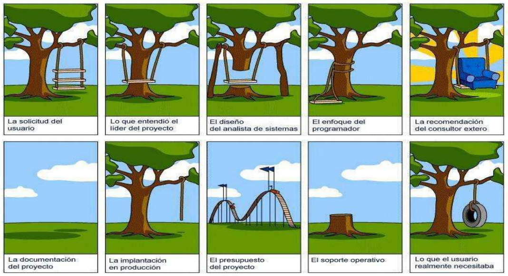
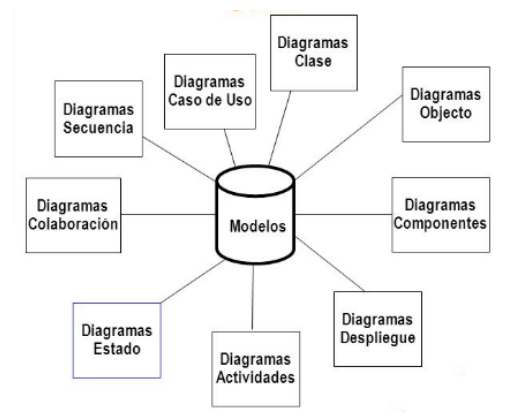
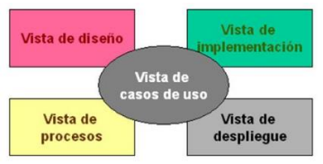
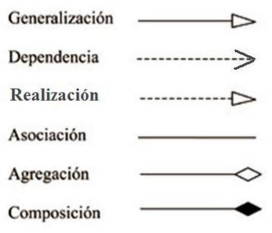

# Teoría

# Unidad 1

## Información

La información no es un dato aislado, esta tiende a ser muy extensa.

La información es un conjunto de datos de diferentes tipos, adecuadamente procesados que proveen un mensaje que tiene sentido comunicacional para contribuir a la toma de decisiones e incrementar el conocimiento.

#### Funciones de la Información

- Aumentar el conocimiento
- Reducir la incertidumbre
- Ayudar a la toma de decisiones
- Permitir realizar controles de tareas y eventos

#### Clasificación de la información


> Imagen tomada de la Figura 1 del apunte (Unidad 1) provisto por la materia_

- **Técnica**: Información que es relevante para la toma de decisiones operativas del díd a día de una organización. El resultado es evidente en el corto plazo.
- **Táctica**: Información que es utilizada para la toma de decisiones relacionadas con la coordinación y comunicación entre distintas area de la organización. Se asocia a la toma de decisiones para el corto y mediano plazo.
- **Estratégica**: Esta información es vital para tomar decisiones que garanticen la supervivencia de la organización y tienen un impacto al corto, mediano y largo plazo.

!> **Pregunta de parcial**: ¿Cuales son los niveles de la información para la organización? :point_up:

## Gestión de Procesos

En todas las organizaciones existen procesos que funcionan de acuerdo a las políticas de la organización y el objetivo de negocio. Gestionar cada uno de estos procesos es lo que se conoce como "Gestión de Procesos"

Para lograr una eficiente gestión de procesos es fundamental que sean identificados y que cumplan con las siguientes características:

1. Ser horizontales
2. Que pueda ser definido
3. Limites que permitan acotar su comienzo y final
4. Que puedan ser representados gráficamente
5. Que sean medibles y controlables
6. Que tengan un responsable a cargo

#### Clasificación de los procesos

- **Procesos Clave**: Son los responsables de desarrollar el producto o servicio que entrega la organización, los procesos operativos propios de la actividad de la organización (_Ej.: Proceso de producción, procesos de ventas, etc._)
- **Procesos Estratégicos**: Dedicados al diseño y la planificación de las estrategias y objetivos de la organización (_Ej.: Proceso de planificación de presupuesto, Proceso de diseño de producto, etc._)
- **Procesos de Apoyo**: Son los que entregan apoyo a los procesos clave de la organización, tiene como objetivo proporcionar los recursos que necesita la organización (_Ej.:Proceso de Formación, Proceso de Logística, etc._)

## Sistema de Información

Un sistema de información es un conjunto de elementos orientados al tratamiento y administración de datos e información, generados y organizados para cubrir una necesidad u objetivo.

Las actividades básicas de un sistema de información son:

- **Entrada**: Son los datos obtenidos a partir de la operatoria de la organización
- **Procesos**: Son las operaciones que se le realizan a los datos con el fin de producir información.
- **Salida**: Es el producto resultante de procesar los datos y que es distribuido a los interesados en forma de informes, estadísticas, etc.
- _Retroalimentación_: Mucha de la información producida (salidas), sirve de entrada para el sistema como retroalimentación para su análisis.


> Imagen tomada de la Figura 2 del apunte (Unidad 1) provisto por la materia

#### Clasificación de los sistemas según su función

- **TPS** _<small>'60</small>_ : Los "**Sistemas de Procesamiento de Transacciones**" tenían la función de procesar transacciones de la organización, por ejemplo pagos, cobros, etc.
- **MIS** _<small>'60-'70</small>_ : Los "**Sistemas de Información Gerencial**"  tienen como objetivo principal mostrar una visión general de la situación de la empresa para la toma de decisiones por parte de los directivos de la organización.
- **DSS** _<small>'70-'80</small>_ : Los "**Sistemas de soporte a decisiones**" son una herramienta de análisis de variables de negocio para apoyar la toma de decisiones.
- **EIS** _<small>'80</small>_ : Los "**Sistemas de Información Ejecutiva**" permiten monitorear el estado de las variables de un área de la organización a partir de información interna y externa a la misma.
- **OAS** _<small>'80</small>_ : Los "**Sistemas de Automatización de Oficinas**" ayudan en el trabajo diaria administrativo de la organización.
- **SE** _<small>'90</small>_ : Los "**Sistemas Expertos**" están diseñados para resolver problemas complejos usando el razonamiento. Estos fueron las primeras formas de **Inteligencia Artificial**.
- **ERP** _<small>'90</small>_ : Los "**Sistemas de Planificación de Recursos**" integran la información de los procesos de la organización en un solo sistema.

## Toma de Decisión

Desde hace mucho tiempo las organizaciones han reconocido que la información es uno de los recursos mas importante con los que cuenta una organización ya que es un apoyo fundamental para la toma de decisiones y la reducción de la incertidumbre.

La información es muy importante en el proceso de toma de decisiones ya que puede reducir el numero de alternativas o clasificar los beneficios o riesgos facilitando la tarea al tomador de decision. Por ser un recurso muy importante, debemos sacar el máximo provecho de este, administrando de manera efectiva la información, teniendo en cuenta su producción, distribución, seguridad,  almacenamiento y recuperación; es por esto que debemos contar con un sistema de información confiables, oportuno y actualizado.


> _Imagen tomada de la Figura 5 del apunte (Unidad 1) provisto por la materia_

El proceso de toma de decisión comienza con detectar una situación que rodea a un problema, analizar esta situación y definir el problema.
Tomar una decisión supone escoger una alternativa, para lo cual necesitamos información sobre estas y las consecuencias ya que selección que hagamos supondrá que se genere nueva información que podrá servir de base para una nueva decisión a tomar y asi sucesivamente.

#### Clasificación de la decisiones en función de la posición jerárquica del decisor

1. **Decisiones Estratégicas**: Son decisiones tomadas en la cumbre de la pirámide jerárquica, tomadas por los altos directivos. Suelen estar orientadas a definir los objetivos estratégicos de la organización.
2. **Decisiones Tácticas**: Estas son tomadas por directivos intermedios y buscar gestionar los recursos de la mejor manera para alcanzar los objetivos estratégicos.
3. **Decisiones Operativas**: Son decididas por los mandos mas bajos de la organización y están referidas a las actividades rutinarias de la empresa.

## Análisis y Metodología de Sistemas

Se trata de estudiar un sistema mediante el enfoque sistémico, atendiendo al planteo del problema a resolver, en donde intervienen personas, recursos físicos, materiales y tiempo.

#### Metodología de Sistemas

La metodología de sistemas es un método que provee herramientas y procedimientos, que son confiables y repetibles, y se adecúan particularmente bien al problema que pretenden resolver o al producto que se quiere desarrollar.

- **Métodos**: Indican como construir técnicamente el sistema, desde la planificación, estimación, análisis de requerimientos, diseño, arquitectura, codificación, pruebas, puesta en producción y mantenimiento.
- **Herramientas**: Suministran un soporte automático o semiautomático para los métodos. Un ejemplo son las herramientas de gestión como Jira, Trello; o las herramientas de modelado como StartUML, PlantUML.
- **Procedimientos**: Relaciona métodos y herramientas para definir la secuencia en la que se aplican los métodos, las entregas que se requieren, los controles que deben hacerse para el aseguramiento de la calidad y la coordinación en los cambios y las directrices que deben seguir los gestores del proyecto para evaluar el progreso.

!> **Pregunta de parcial**: Definición de Metodología de Sistemas :point_up:

Existen dos grandes grupos donde encuadrar a las metodologías, el entorno **tradicional** y el entorno **ágil**, sin embargo comparten un conjunto de características comunes que definen el ciclo de vida típico de un sistema.


> _Imagen tomada de la Figura 8 del apunte (Unidad 1) provisto por la materia_

- **Inicio**: Es la _"visión del sistema"_, donde se establece el alcance del proyecto y se toma la decisión de comenzar con el mismo (se decide realizar la inversión de dinero y esfuerzo).
- **Elaboración**: Se hace el análisis del sistema de negocio para el cual se busca solución, se define la estructura general del sistema de información, se identifican los factores de riesgo del proyecto y se elabora el plan detallado.
- **Construcción**: Es la fabricación del sistema de información con todos sus productos de apoyo (documentación, casos de prueba, etc.). En esta etapa se revisan las definiciones de las fases anteriores. 
- **Transición**: El sistema se entrega a los usuarios; esta fase incluye la instalación, configuración, soporte a usuarios y correcciones si fuera necesario. Finaliza cuando los usuarios están satisfechos con el sistema.

!> **Pregunta de parcial**: Ciclo de vida de un sistema de información :point_up:

## Metodología Tradicional

Estas metodologías buscan una fuerte planificación y documentación durante todo el desarrollo del proyecto, es decir, se sustentan en llevar una documentación exhaustiva y cumplir con un plan de proyecto estricto y cerrado, centrando su atención en la planificación por adelantado y la gestión de procesos.

Estas características las hace indicadas para proyectos donde se presentan objetivos claramente definidos desde el inicio y proyectos a largo plazo que no tengan restricciones de tiempos.

Existen 4 actividades fundamentales para la ingeniería de software:

1. **Especificación de requerimientos**: Es donde se definen las funcionalidades que el software debe tener y las restricciones de su operación.
2. **Diseño e implementación del software**: Se representa un modelo que cubra las especificaciones definidas en la actividad anterior.
3. **Validación del software**: En esta actividad se valida que el software está de acuerdo con la especificación definida y cumpla con lo que usuario quiere.
4. **Evolución del software**: Es la evolución del software ara cubrir nuevas necesidades o cambios que el usuario quiere.

### Modelo clásico en Cascada

Este modelo plantea un enfoque sistémico y secuencial del desarrollo de software que sigue los pasos de análisis, diseño, codificación, prueba y mantenimiento; estas actividades (fases) se ejecutan en este orden especifico y nunca comienza una fase si no ha concluido la anterior. En las actividades siguientes se pueden detectar problemas o errores de las actividades previas, estas pueden generar retroalimentación que actualice la documentación de la fase previa, aunque volver atrás puede ser muy difícil y costoso. 
La desventaja de este modelo es la dificultad para especificar los requerimientos al comienzo del proyecto ya que olvidar algo puede resultar muy costoso, es por eso que el modelo apunta a no permitir cambios, lo que **NO RESULTA** acorde a las necesidades actuales.

!> **Pregunta de parcial**: ¿Cuales son los PRO/CONTRA de las Metodologías Tradicionales? :point_up:



> _Imagen tomada de la Figura 9 del apunte (Unidad 1) provisto por la materia_

1. **Análisis y definición de requerimientos**: Se establecen los requerimientos, servicios y las restricciones para cubrir el propósito del sistema.
2. **Diseño del sistema y del software**: Se establece la arquitectura de sistema y se identifican y describen las abstracciones fundamentales del sistema de software.
3. **Implementación y prueba de unidad**: Se verifica que cada unidad cumpla con su especificación.
4. **Integración y prueba de sistema**: Las unidades se integran y prueban como un sistema completo para asegurarse de que se cumpla con la especificación. Después de probarlo, se libera el sistema de software al cliente.
5. **Operación y mantenimiento**: El sistema se instala y se pone en práctica. El mantenimiento incluye corregir los errores que no se detectaron en etapas anteriores, mejorar la implementación e incrementar los servicios conforme se descubren nuevos requerimientos.

### Modelo de Prototipos

El modelo de prototipos facilita al programador la tarea de crear un modelo de software aunque no sea tan funcional como el producto final. Se genera a partir de un conjunto de objetivos generales sin identificar la información detallada de estos. Como ventaja, permite recibir retroalimentación de manera temprana y asi detectar modificaciones a implementar. Como desventaja, presenta una funcionalidad limitada y con características pobres.

En este modelo es clave dejar claro que el prototipo no es la version final del software y que no reunirá todas las funcionalidades finales, solo se construye a los fines prácticos de servir como mecanismos para la definición de los requisitos; posteriormente se construirá el sistema real final.



> _Imagen tomada de la Figura 10 del apunte (Unidad 1) provisto por la materia_

### Modelo en espiral

Cubre las mejores características del modelo clásico, como las del modelo de prototipos. Se trata de un modelo iterativo donde por cada vuelta al ciclo, se construye una nueva version del software que amplia su funcionalidad. La idea de esta metodología es dividir el proyecto se software en proyectos mas pequeños, por eso es uno de los modelos mas realistas para el desarrollo de sistemas a gran escala.



> _Imagen tomada de la Figura 11 del apunte (Unidad 1) provisto por la materia_ 

- **Planificación**: Se determinan los objetivos, alternativas y restricciones.
- **Análisis de Riesgo**: Se identifican y/o resuelven los riesgos.
- **Implementación**: Se desarrolla el producto de siguiente nivel.
- **Evaluación del cliente**: Se valoran los resultados.

Se comienza por en una escala pequeña del producto en el centro del espiral, se hace un análisis de los riesgos y un plan para manejarlos, se establece una aproximación a la siguiente iteración y se avanza en consecuencia con el desarrollo para finalizar con la evaluación por parte del usuario. Si bien aca se describen lo 4 pasos básicos, el espiral puede adaptarse a las necesidades del proyecto y tener mas pasos. Adicionalmente, este modelo puede combinarse con otros modelos (empezar en espiral y terminar en cascada).

Como el modelo hace una gestión de riesgos en cada iteración, a medida que los costos suben, los riesgos disminuyen. Ademas permite ir eliminando errores en cada iteración lo que ayuda a evitar retrasos en el proyecto.

## Metodología Ágil

Las **metodologías ágiles** o **Agile** están basadas en el trabajo en equipo, la colaboración, las tareas y en adaptarse a los cambios lo mas rápido posible (Un cambio representa una oportunidad). Estas nacieron en respuesta a las problemáticas que tenían las metodologías tradicionales promoviendo por sobre tdo lo demás la capacidad de adaptarse.

#### Beneficios de la gestión agile

- Prioridades flexibles
- Entregas tempranas
- Costos y plazos conocidos
- Mejor calidad final
- Mayor transparencia

!> **Pregunta de parcial**: ¿Cuales son las ventajas de las Metodologías Ágiles? :point_up:

#### Manifiesto Agile

- **Individuos e interacciones** sobre procesos y herramientas
- **Software funcionando** sobre documentación extensiva
- **Colaboración con el cliente** sobre negociación contractual
- **Respuesta ante el cambio** sobre seguir un plan

> _Fuente https://agilemanifesto.org/iso/es/manifesto.html_ 

### XP

"**_El software como solución ágil y no como proyectos arquitectónicos_**". Algunos la definen mas como un movimiento "social" de los desarrolladores hacia las personas de negocio, de lo que debería ser el desarrollo de software en contraposición a los legalismos de los contratos de software.

?> **Tip**: 

### Scrum

Scrum es un marco de trabajo iterativo (**Sprints**) en ciclos de entre 1 a 4 semanas, para el desarrollo de proyectos, aplicaciones y productos. Cada Sprint comienza con la ceremonia de "**Spring Planning**" donde se seleccionan los requisitos a trabajar en el Sprint (**Sprint Backlog**) de una la lista priorizada (**Product Backlog**). Durante el Sprint, cada día el equipo se reúne para  informar del progreso del trabajo comprometido (**Daily**). Al final del Sprint el equipo expone el producto obtenido del esfuerzo de la iteración en una ceremonia llamada "**Review**" y recoge los comentarios y observaciones para incorporarlos en la siguiente iteración. Como cierre, el equipo se reúne para analizar como se ejecuto este Sprint y revisar las oportunidades de mejora para las siguientes iteraciones (**Retrospective**).



> _Imagen tomada de la Figura 13 del apunte (Unidad 1) provisto por la materia_ 

### Lean

Esta metodología describe un producto mínimo viable (**MVP**) como la versión minima de un producto que permite al equipo recolectar la cantidad máxima de aprendizaje validado sobre clientes con el menor esfuerzo.

Este metodología se basa en un enfoque centrado en el cliente en vez de en el producto, buscando aprender de cada iteración del producto para poner a prueba hipótesis y poder saber hacia donde avanzar. por eso es importante avanzar con rapidez y no esperar a tener un producto perfectamente acabado (mientras antes podamos probar el producto con clientes reales mejor). Se trata de una filosofía basada en la experimentación con ciclo de desarrollo muy cortos. Otra clave es saber cuando seguir y cuando no sobre una linea de trabajo. 



> _Imagen tomada de la Figura 14 del apunte (Unidad 1) provisto por la materia_

Lean cambia el clásico ciclo de vida de desarrollo por el ciclo de vida de aprendizaje.
- **Construir**: Se desarrolla un MVP centrado en la hipótesis que se quiere validar.
- **Medir**: Se establecen métricas con las cuales valorar el experimento.
- **Aprender**: De las métricas sacamos información con la cual aprendemos del negocio para seguir mejorando el producto.

### Kanban

La palabra "Kanban viene de **Kan** (visible/visual) y **Ban** (tarjeta/tablón). El objetivo de la metodología es organizar las tareas escritas en tarjetas y organizadas en un tablero dividido en columnas que indican en que estado está la tarjeta o tarea; las tareas dentro de cada columna se organizan de mayor a menor prioridad, estando en lo mas alto la de mayor prioridad. Opcionalmente el sistema permite establecer filas o carriles especiales por encima de las columnas para establecer ciertos criterios (_Por ejemplo, un carril para las tareas urgentes_). Las principales columnas utilizadas en Kanban son:

- **Objetivos** (_Opcional_): Se marcan a largo plazo con el objetivo de que todos los tengan presentes.
- **Pendientes**: Engloba las tareas pendientes que se pueden ejecutar de manera inmediata.
- **Preparación** (_Opcional_): Tareas que necesitan cierta discusión antes de ser afrontadas.
- **Desarrollo**: Aquí ponemos las tareas mientras se están ejecutando y hasta que terminamos.
- **Prueba**: Probamos que todo funciona bien, si es asi, la tarjeta avanza, sino retrocede.
- **Aplicación** (_Opcional_): Aquí van tareas como instalar una versión en un servidor.
- **Hecho**: Cuando la tarea es terminada se pone en esta columna.


## Diferencias entre metodologías tradicionales y ágiles

Las **metodologías tradicionales** imponen una disciplina fundamentada en la documentación por sobre el desarrollo de software, hacen hincapié en la planificación global; mientras que las **metodologías ágiles** pone delante el desarrollo de software primero y muchas veces obvia la documentación tratando de buscar un equilibrio entre el proceso y el esfuerzo.

| Metodologías ágiles                            | Metodologías Tradicionales                             |
|:----------------------------------------------:|:------------------------------------------------------:|
| Flexibles a cambios                            | Poco flexibles a cambios                               |
| Proceso poco controlado, pocas normas          | Proceso muy controlado, con muchas normas              |
| El cliente es parte activa del proceso         | El cliente interactúa con el equipo en las entregas    |
| Grupos pequeños con vision de todo el proceso  | Grandes grupos con vision solo de la tarea asignada    |
| Menos énfasis en la arquitectura               | La arquitectura es esencial y se modela                |

!> **Pregunta de parcial**: Diferencias entre Metodología Tradicional y Agile :point_up:

## Requerimientos

Las mayores causas de fracaso de los proyectos de desarrollo se debían a fallas en la definición de los requerimientos, este es un problema vinculado con la comunicación y los vínculos sociales que se establecen entre todos los involucrados en el proyecto de desarrollo.



> _Imagen tomada de la Figura 16 del apunte (Unidad 1) provisto por la materia_

Los problemas mas comunes son:
- Los requerimientos no son siempre fáciles de expresar de manera clara mediante palabras.
- El número de requerimientos puede volverse inmanejable si no se controla.
- Los requerimientos cambian.

### ¿Que es un requerimiento?

Un requerimiento es una capacidad que el software debe poseer para cubrir una necesidad del usuario para resolver un problema o alcanzar un objetivo. En otras palabras, es una característica que debe incluirse en el software.

Para poder identificar un requerimiento debemos adquirir conocimientos de las organización, encontrar aquellos problemas que necesitan resolverse o falta de información que entorpecen la toma de decisiones y generan incertidumbre.

### Diagnostico del problema

Los problemas o inconvenientes son aquellas situaciones que ocasionan ciertos obstáculos que nos alejan del objetivo, y que requieren de una solución; estos son los casos que debemos detectar. Mal podremos comprender los requerimientos si no formulamos adecuadamente el problema.
Para comprender si se trata de un problema o un requerimiento, debemos comprender que los requerimientos están orientados a lo que el cliente necesita, aquello que desea.

### Objetivo del SI

El objetivo del SI es el foco de la propuesta del que se desprenden los objetivos específicos que resumen la solución hallada en el diagnostico del problema. El objetivo general del SI es en correspondencia con los requerimientos del cliente y el análisis de requerimientos globales. Siempre se plantea un solo objetivo general.

La forma de redactar un objetivo es:

```
Brindar información para la gestión de XXX, gestión de XXX de la empresa XXXX para facilitar la toma de decisiones sobre XXX
```

### Limite del SI

El limite del sistema se redacta usando las palabras desde/hasta.
```
Desde la registración de XXX, hasta que se emiten los informes de XXX
```

### Alcance del SI

El alcance del SI son todas aquellas tareas de captación, procesamiento y emisión de información, para brindar apoyo a las actividades de la organización asociadas a los requerimientos. Debemos usar solo los verbos **Registrar, Actualizar, Consultar, Emitir, Generar**

### Salidas del SI

Son todas aquellas salidas que genera el SI, debemos tener en cuenta que por cada salida generada, debemos haber incluido en los alcances la captación de datos para generar dichas salidas.

### Ingeniería de Requerimientos

El nivel de importancia de los requerimientos ha dado lugar a un tipo de especialización de la ingeniería. El proceso de  ingeniería de requerimientos se enfoca en evitar el fracaso de los proyectos y producir un documento que describa las necesidades del cliente y usuarios del sistema. Existen 3 pasos dentro de este proceso:

- **Obtener**: Proceso para obtener los requerimientos del sistema mediante un estudio inicial o relevamiento.
- **Especificar**: Trascribir la información recopilada durante la actividad de obtención en un documento que defina los requerimientos. Para esto se acuerda un lenguaje común que permita a todos los participantes llegar a un mismo entendimiento. también se usan normas y estándares para la redacción de modo tal que se pueda cumplir con esta característica. Esta especificación debe abordar lo **que** hay que hacer y no el **como**.
- **Validar**: Verifica que los requerimientos sean **Verificable** (un requerimientos debe poder comprobarse para saber si se cumplió), **Conciso** (fácil de leer y entender), **Completo** (tiene la información suficiente para su comprensión), **Consistente** (no debe ser contradictorio con otro requerimiento), **No ambiguo** (tiene una sola interpretación, no debe causar confusión).

### Requerimientos Funcionales (RF)

Describe la funcionalidad o los servicios que se espera que el sistema provea o cubra, son las funciones que el sistema será capaz de llevar a cabo sin tener en cuenta restricciones físicas.

### Requerimientos No Funcionales (RNF)

Son aquellos que no se refieren a las funcionalidades especificas del sistema, sino a las propiedades que aseguran la calidad del software, por ejemplo, fiabilidad, tiempos de respuestas, capacidad de almacenamiento, etc.

# Unidad 2

## Modelos UML

El objetivo de UML es adaptar, expandir y simplificar los tipos de diagramas existentes y aceptados de varios métodos orientados a objetos. El modelado del software es una técnica de ingeniería probada y bien aceptada para construir modelos arquitectónicos de un producto de SW. UML es un lenguaje estándar para escribir “planos” de software que permiten visualizar, especificar, construir y documentar bloques de información, llamados artefactos, de un sistema que involucra software.

### ¿Qué es un modelo?

- Un modelo proporciona los planos de cómo es el sistema, tendremos modelos con mayor o menor grado de detalle que van a describir las diferentes perspectivas en cada etapa del ciclo de desarrollo.
- Un modelo es una abstracción de la estructura y comportamiento del sistema.
- Un modelo proporciona plantillas que sirven de guía en la construcción de un programa.
- Un modelo representa y permite visualizar relaciones de trazabilidad entre los diferentes modelos.
- Un modelo documenta las decisiones que se han adoptado.

!> **Pregunta de parcial**: Multiple choose de practica para el parcial :point_up:

### Propósito de UML

- Visualizar: Un modelo explícito facilita la comunicación. UML es un lenguaje gráfico, detrás de cada símbolo en la notación UML hay una semántica bien definida. Así, un desarrollador puede interpretar ese modelo sin ambigüedad.
- Especificar: UML cubre la especificación de todas las decisiones de análisis, diseño e implementación que deben realizarse al desarrollar y desplegar un sistema de software.
- Construir: UML no es un lenguaje de programación visual, pero sus modelos pueden conectarse de forma directa a una gran variedad de lenguajes de programación. Esta correspondencia permite ingeniería directa: "_la generación de código a partir de un modelo UML_"
- Documentar: Una organización de software que trabaje bien produce toda clase de artefactos además de código ejecutable. Estos artefactos incluyen, entre otros: requisitos, arquitectura, diseño, código fuente, planificación de proyectos, pruebas, prototipos, versiones.

## Bloques de construcción de UML

Para utilizar UML necesitamos definir tres clases de bloques de construcción: **elementos**, **diagramas** y **relaciones**.

### Elementos

Existen 4 tipos de elementos en UML.

- **Elementos estructurales**: Son los elementos estructurales básicos que se pueden incluir en el modelo UML.
- **Elementos de comportamiento**: Son las partes dinámicas de los modelos UML. Estos son los verbos de un modelo y representan comportamiento en el tiempo y en el espacio.
  - **_Interacción_**: Comprende un conjunto de mensajes intercambiados entre un conjunto de objetos, dentro de un contexto particular para alcanzar un propósito específico.
  - **_Máquina de Estados_**: Especifica las secuencias de estados por las que pasa un objeto durante su vida en respuesta a eventos.
- **Elementos de agrupación**: Son las partes organizativas de los modelos UML. Estos son las cajas en las que pueden descomponerse un modelo.
- **Elementos de anotación**: Son las partes explicativas de los modelos UML.

### Diagramas

Los diagramas de UML sirven para visualizar un sistema desde diferentes perspectivas o vistas.



> _Imagen tomada de la Figura 7 del apunte (Unidad 2) provisto por la materia_

#### El modelo de vistas 4+1

El modelo “4+1” de **Kruchten**, es un modelo de vistas que se utiliza para describir la arquitectura de un sistema software intensivo basado en el uso de múltiples puntos de vista. Se ha de documentar y mostrar con 4 vistas bien diferenciadas y se han de relacionar entre sí con una vista más, que es la denominada vista “+1”. Las denominó: **Vista lógica**, **Vista de procesos**, **Vista de despliegue**, **Vista física** y **Vista de Escenario** (+1).

Las vistas de UML son 5, tal que la vista principal es la** vista de casos de uso** que permite mostrar los requisitos del sistema, luego la **vista de diseño** y **vista de procesos** que permiten mostrar lo que ocurre dentro del sistema, la **vista de implementación** permite mostrar el cambio de estados de los objetos y modelar aspectos relacionados con requisitos no funcionales y cercano al desarrollo y finalmente, la **vista de despliegue** permite mostrar aspectos físicos del sistema como por ejemplo la arquitectura en donde se van a instalar y distribuir los componentes.



> _Imagen tomada de la Figura 9 del apunte (Unidad 2) provisto por la materia_

### Relaciones

Una relación define la conexión entre elementos de UML. Para diferenciar las distintas relaciones se utilizan varios tipos de líneas.



> _Imagen tomada de la Figura 11 del apunte (Unidad 2) provisto por la materia_

